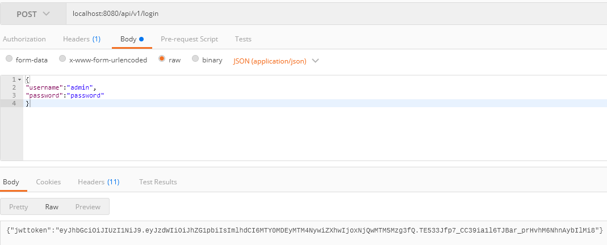
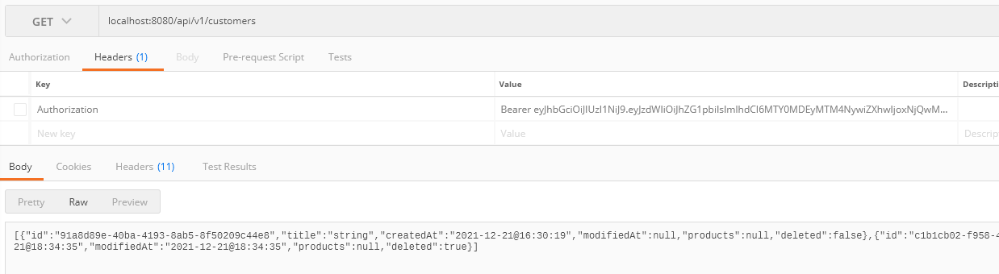

# Customer products Service API

### Database script

>CREATE DATABASE customerproducts
WITH
OWNER = postgres
ENCODING = 'UTF8'
LC_COLLATE = 'Russian_Russia.1251'
LC_CTYPE = 'Russian_Russia.1251'
TABLESPACE = pg_default
CONNECTION LIMIT = -1;

>CREATE TABLE public.customers
(
id uuid NOT NULL,
title character varying(255) COLLATE pg_catalog."default" NOT NULL,
is_deleted boolean NOT NULL DEFAULT false,
created_at timestamp with time zone NOT NULL,
modified_at timestamp with time zone,
CONSTRAINT customers_pkey PRIMARY KEY (id)
)
TABLESPACE pg_default;
ALTER TABLE public.customers
OWNER to postgres;

>CREATE TABLE public.products
(
id uuid NOT NULL,
customer_id uuid references customers (id),
title character varying(255) COLLATE pg_catalog."default" NOT NULL,
description character varying(1024) COLLATE pg_catalog."default",
price double precision,
is_deleted boolean NOT NULL DEFAULT false,
created_at time with time zone,
modified_at time with time zone,
CONSTRAINT products_pkey PRIMARY KEY (id)
)
TABLESPACE pg_default;
ALTER TABLE public.products
OWNER to postgres;

--------------
### Request examples

Login: localhost:8080/api/v1/login

Body:
{
"username":"admin",
"password":"password"
}

Get example: localhost:8080/api/v1/customers

Header: Authorization

Swagger url: http://localhost:8080/swagger-ui/index.html#/

